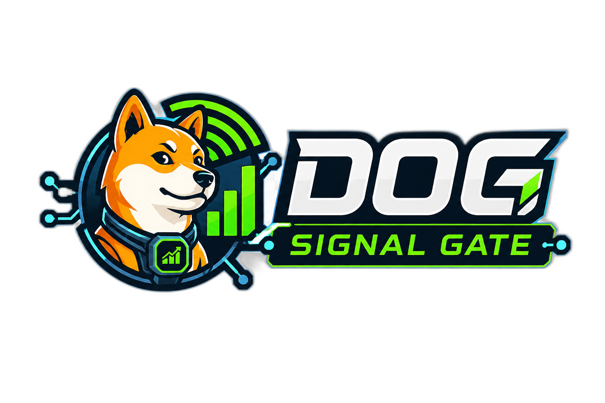

# DogSignal Gate Knowledge MCP

<p align="center">
  
</p>

<p align="center">
  <strong>Dog Signal Gate 开源智能交易体系的知识层、RAG 层和 MCP 调用入口。</strong>
</p>

<p align="center">
  <a href="https://terrydengbin-glitch.github.io/dog-signal-gate-home/">Dog Signal Gate 官网</a>
  ·
  <a href="https://github.com/terrydengbin-glitch/Strategy-Lab">Strategy Lab</a>
  ·
  <a href="https://github.com/terrydengbin-glitch/ai_traders">AI Trader</a>
</p>

## 项目定位

DogSignal Gate Knowledge MCP 是 Dog Signal Gate 开源智能交易体系中的 **知识基础设施层**。

它不生成神秘信号，不替代策略引擎，不让 LLM 直接下单。它的职责是把交易工程、AI Engineering、回测审计、风险治理、模拟盘、持续学习和外部项目接入经验沉淀成可检索、可审计、可引用的知识库，让 AI IDE、Agent、策略研发项目和 AI Trader 项目可以稳定调用专业上下文。

```text
专业资料 / 论文 / 官方文档 / 项目复盘
  -> 候选知识采集
  -> AI / 人工严格审计
  -> formal reviewed 知识沉淀
  -> MCP / SearchLab / Vue3 知识树调用
  -> Strategy Lab 与 AI Trader 开发过程消费
```

本仓库当前对应 Dog Signal Gate 三层体系中的第 1 层：

| 层级 | 项目 | 职责 |
| --- | --- | --- |
| 01 | **Knowledge MCP** | 沉淀 AI Engineering、Trading Engineering、回测审计、风险治理、数据契约和持续学习知识 |
| 02 | [Strategy Lab](https://github.com/terrydengbin-glitch/Strategy-Lab) | 策略沙盒、回测、回放、模拟盘、Trade Quality 归因和训练数据生成 |
| 03 | [AI Trader](https://github.com/terrydengbin-glitch/ai_traders) | 候选信号评分、校准、LLM 审计解释、确定性 Final Gate 和发布治理 |

> 完整体系说明见：[Dog Signal Gate 官网](https://terrydengbin-glitch.github.io/dog-signal-gate-home/)

## 为什么需要 Knowledge MCP

交易研发和 AI Trader 项目经常遇到几个重复问题：

- AI IDE 不理解回测、回放、模拟盘和实盘之间的链条差异。
- LLM 容易把候选信号、交易决策、订单执行和结果归因混成一件事。
- 只看胜率、收益或 PF，忽略成本、滑点、流动性、样本外验证和执行失败。
- 项目知识散落在聊天记录、脚本、报告和临时文档里，无法被稳定复用。
- 不同项目对同一术语的理解不一致，导致接口、数据、训练标签和风控边界错位。

Knowledge MCP 解决的是 **专业上下文治理**：

- 用结构化知识卡保存来源、适用范围、不适用场景、冲突审计和机器门控。
- 用知识树把 AI Engineering 与 Trading Engineering 分层归类。
- 用 MCP 让外部项目可以只读检索正式知识。
- 用 Vue3 审计工作台让人类审核候选知识、来源、缺口和冲突。
- 用候选到 reviewed 的流程防止未经审计的内容进入正式知识库。

## 当前核心能力

### 1. 交易工程知识库

覆盖 Trading Engineering 的关键分支：

- Quant Foundation：R-multiple、期望值、风险收益比、样本量和 regime 边界。
- Data Engineering：OHLCV、known-at、数据版本、raw / adjusted 分层和质量报告。
- Kline Strategy：K 线信号、指标滞后、多周期、止损失效逻辑和信号边界。
- Market Microstructure：盘口、价差、流动性 regime、OI / Funding、CVD、订单流代理。
- Backtest：lookahead bias、成本模型、OOS、walk-forward、reproducibility package。
- Replay / Simulation：OHLC 同根 TP/SL、fill model、paper/live gap、sandbox 环境。
- Live Execution / Risk：订单状态机、仓位对账、kill switch、API 权限和风险策略。
- Trade Analysis：MAE/MFE、planned vs realized R、reason code、bad-case taxonomy。

### 2. AI Engineering 知识库

面向外部 LLM gating / scoring / AI Trader 项目：

- Numeric Scorer：Logistic Regression、LightGBM、XGBoost、CatBoost 等表格模型边界。
- Calibration / Threshold：Platt、isotonic、ECE、Brier、阈值策略和 abstain band。
- Qwen / LLM Audit Assistant：LLM 只做审计解释、字段检查、reason code 和 RAG 引用。
- Final Gate：最终交易放行必须由确定性规则和治理状态决定。
- Continuous Learning：数据漂移、shadow pool、事件回放、模型发布和回滚治理。
- Memory Layer：外部项目 AI 记忆的目标、任务、过程、错误、计划和追踪边界。

### 3. 只读 MCP 检索服务

外部项目可以通过 MCP 调用正式知识库：

```text
search_expert_knowledge
get_knowledge_item
browse_knowledge_tree
list_kb_partitions
get_conflict_audit
get_source_profile
```

MCP 默认只读。它不会下单，不读取账户，不读取密钥，不修改知识，也不会把候选知识当成默认指导。

### 4. Vue3 知识审计工作台

`ui/` 提供本地审计工作台，用于：

- 浏览知识树。
- 查看正式知识。
- 审核候选知识。
- 导出 AI 审计包。
- 查看来源、冲突、缺口和回灌状态。
- 验证 SearchLab / MCP / 知识树是否联动正常。

### 5. 候选到正式知识工作流

固定链路：

```text
候选采集
  -> 导出 AI 审计包
  -> 外部 AI / 人工审计
  -> Codex 按补丁优化
  -> formal reviewed 知识沉淀
  -> 重建索引和前端 fixture
  -> 后续人工另行决定是否 approved
```

关键边界：

```text
candidate 不等于正式知识。
accepted_for_draft 不等于 approved。
reviewed 不等于 approved。
caveat_only 不进入默认指导队列。
approved 和 hard gate 必须另行人工治理。
```

## 一分钟接入

外部项目只想先验证能否调用知识库时，可以这样做：

```powershell
$env:CEK_TA_ROOT = "替换为你的 Knowledge MCP 根目录"
cd $env:CEK_TA_ROOT

python codex-expert-kit/mcp/server.py --info
python codex-expert-kit/mcp/server.py --list-tools
python codex-expert-kit/mcp/server.py --call search_expert_knowledge --request-json "{\"query\":\"lookahead bias\",\"top_k\":3}"
```

如需显式指定正式知识索引：

```powershell
$env:CEK_TA_KNOWLEDGE_ITEMS_PATH = "$env:CEK_TA_ROOT\codex-expert-kit\rag\indexes\knowledge_items.json"
python codex-expert-kit/mcp/server.py --info
```

健康检查通过后，再把模板复制到外部项目的 Codex MCP 配置中：

```text
codex-expert-kit/templates/codex_config_mcp.toml
```

模板默认使用：

```toml
enabled = false
```

只有当 `--info`、`--list-tools` 和一次查询 smoke test 通过后，业务项目才应改为：

```toml
enabled = true
```

## 常用命令

### MCP 运行时检查

```powershell
python codex-expert-kit/mcp/server.py --info
python codex-expert-kit/mcp/server.py --list-tools
```

### 搜索知识

```powershell
python codex-expert-kit/mcp/server.py --call search_expert_knowledge --request-json "{\"query\":\"paper trading live gap\",\"top_k\":5}"
```

### 浏览知识树

```powershell
python codex-expert-kit/mcp/server.py --call browse_knowledge_tree --request-json "{\"root\":\"kt.trading_engineering\",\"max_depth\":3}"
```

### 读取单条知识

```powershell
python codex-expert-kit/mcp/server.py --call get_knowledge_item --request-json "{\"knowledge_id\":\"替换为 knowledge_id\"}"
```

### 启动 Vue3 审计工作台

```powershell
cd ui
npm install
npm run dev
```

默认开发地址通常是：

```text
http://127.0.0.1:5173/
```

如果端口被占用，请按 Vite 输出的新端口访问。

## 仓库结构

```text
.agents/
  skills/                         CEK-TA 开发工作流 Skill

codex-expert-kit/
  api/                            FastAPI 只读接口
  core/                           路径 resolver 和基础工具
  mcp/                            MCP 只读知识检索服务
  rag/
    candidates/                   候选知识队列
    knowledge/                    formal reviewed / approved 知识
    indexes/                      MCP 默认正式知识索引
    scripts/                      索引构建、质量门禁、审计导出脚本
  templates/                      外部项目接入模板

docs/
  audit/                          AI / 人工审计包与审计结果
  assets/                         README 和文档资产
  contracts/                      数据、MCP、知识、治理契约
  reports/                        Phase 验收和质量报告
  research/                       来源采集和知识范围设计
  tasks/                          Phase 任务卡

ui/
  src/                            Vue3 审计工作台
  public/data/                    前端 fixture 数据

contributions/                    外部项目知识倒灌队列
```

## 关键文档

- [外部项目 MCP 快速接入手册](./docs/external_mcp_quickstart.md)
- [其他项目接入指南](./docs/其他项目接入指南.md)
- [MCP server 规格](./codex-expert-kit/mcp/mcp_server_spec.md)
- [正式知识索引说明](./codex-expert-kit/rag/indexes/README.md)
- [知识库采集与审计规范](./docs/知识库采集与审计规范.md)
- [知识倒灌与反哺规范](./docs/知识倒灌与反哺规范.md)
- [项目任务索引](./docs/index_tasks.md)
- [Phase 任务卡目录](./docs/tasks/README.md)
- [开发规范入口](./AGENTS.md)

## 与 Strategy Lab / AI Trader 的关系

```text
Knowledge MCP
  提供交易工程、AI Engineering、回测审计、数据治理和模型训练约束。

Strategy Lab
  消费 Knowledge MCP 的方法论，生成候选信号、跑沙盒、回测、回放、模拟盘和 Trade Quality。

AI Trader
  消费 Strategy Lab 的 candidate ledger、known-at 特征和质量标签，训练 scorer，做校准、审计和确定性 Final Gate。
```

Knowledge MCP 不负责训练模型，也不负责执行交易。它负责提供可靠的专业上下文、边界、来源和治理规则。

## 硬边界

```text
LLM 不直接下单。
MCP 不读取账户、密钥或实盘事实。
MCP 默认只读，不写入知识库。
候选知识不能作为默认指导。
reviewed 不等于 approved。
caveat_only 只能用于审计和检索，不进入默认指导队列。
default guidance、approved、hard gate 必须另行人工治理。
回测、回放、模拟盘和实盘必须链条等效才可比较。
任何交易策略、模型评分或 gate 结果都不构成投资建议。
```

## 当前状态

本仓库已经包含：

- AI Engineering 与 Trading Engineering 的正式知识库。
- 候选知识、审计包、补证包和正式沉淀流程。
- MCP 只读检索服务。
- Vue3 知识审计工作台。
- 外部项目接入模板。
- 知识树、SearchLab、MCP、前端 fixture 和质量门禁脚本。

当前重点是继续提升：

- 正式知识覆盖度。
- 外部项目接入体验。
- Vue3 大知识树性能。
- MCP 检索质量和引用质量。
- Strategy Lab / AI Trader 的知识消费闭环。

## 开源共建

Dog Signal Gate 希望把交易研究从“个人脚本”和“聊天记录”推进到可复现、可审计、可持续迭代的工程系统。

欢迎贡献：

- 专业资料来源和知识卡补充。
- 回测、模拟盘、实盘链条审计案例。
- AI Engineering、RAG、MCP、LLM 审计助手经验。
- Vue3 审计工作台交互优化。
- 外部项目接入模板和 smoke test。
- Strategy Lab / AI Trader 联动案例。

小贡献也有价值：修一处文档、补一个来源、改一个测试、整理一个 schema，都会让这套开源智能交易系统更可靠。

## 风险提示

本项目用于交易工程、AI Engineering、知识治理、回测审计和开源研发协作，不构成投资建议。任何策略、模型、评分、过滤、审计报告或 gate 结果，都必须经过成本、滑点、流动性、样本外验证、模拟盘和受控风险限制检验后，才能考虑进入真实资金环境。
