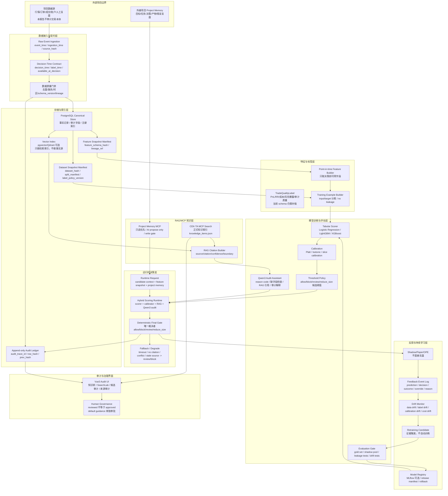
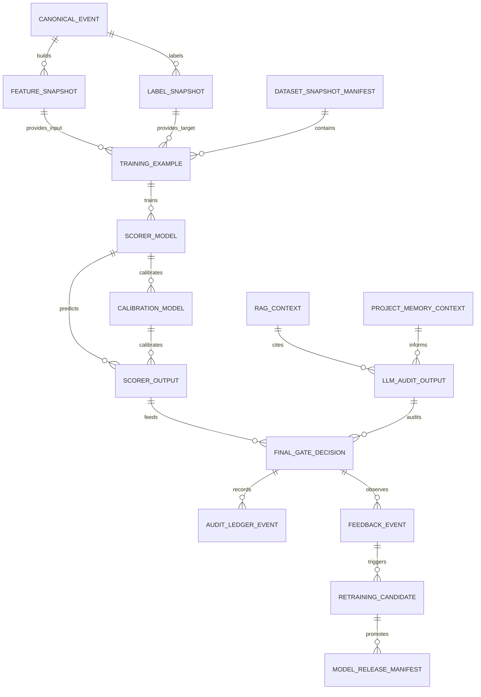

# Phase 44 AI 层业务流拓扑与技术栈断层审计

生成日期：2026-06-11

## 审计口径

本报告只审计 AI 层技术方案，不审计 Trading Engineering 本体。

范围内：

```text
1. 数据接入后的 AI 数据契约、存储、特征、标签、训练、评估、发布、RAG/MCP、LLM 审计、final gate、持续学习、项目记忆和审计 UI。
2. AI 交易质量 gating/scoring 项目的技术底座是否闭环。
3. 当前知识库是否足够让外接项目 AI IDE 设计和审计这套 AI 层方案。
```

范围外：

```text
1. 不审计 K 线形态、策略信号、订单流、盘口微观结构、仓位规则、实盘交易所 adapter 等 Trading Engineering 本体。
2. 不生成买卖点、仓位、杠杆、止损止盈或实盘订单。
3. 不实现项目，只做知识库断层审计。
```

## 总体判断

从 AI 层技术底座看，当前知识库已经基本能支撑一个外接 AI 交易质量项目的主干架构：

```text
数据契约 -> canonical store -> feature/dataset manifest -> tabular scorer -> calibration/threshold -> Qwen3 审计助手 -> RAG/MCP 引用 -> deterministic final gate -> shadow/paper/OPE -> feedback/retraining -> model registry -> Project Memory
```

强项：

```text
1. 数据库与存储治理强：PostgreSQL canonical store、dataset/feature manifest、audit_trace_id、vector index 边界明确。
2. 模型职责边界强：LightGBM/XGBoost/Logistic Regression 做数值 scorer，Qwen3 做审计解释，final gate 做确定性裁决。
3. 持续学习强：feedback logging、label refresh、drift、retraining trigger、model registry、release manifest 已成体系。
4. RAG/MCP 和 Project Memory 强：主动检索、引用、阻断、项目记忆边界和写入门禁明确。
```

主要断点：

```text
1. AI 层统一事件总线和数据对象拓扑还没有被正式固化。
2. TradeQualityLabel / ScoringExample / PaperEvaluation 的字段级 schema 不够集中。
3. Feature Store 是否引入、何时引入、offline/online parity 的运行时验收还缺一张总契约。
4. Final Gate 的输入输出、状态机、降级路径和可解释审计 payload 需要更完整。
5. 从 feedback log 自动生成 retraining candidate 的流程还缺运行时样板。
6. AI 层全链路观测指标和 SLO 还偏分散，缺统一 runtime dashboard contract。
```

## 业务流拓扑图



## 分层技术栈建议

| 层级 | 推荐技术栈 | 当前知识库支撑度 | 说明 |
| --- | --- | --- | --- |
| 运行语言 | Python | 高 | 适合数据处理、模型训练、MCP/FastAPI 脚本和批处理 |
| API/MCP | FastAPI + MCP server | 中高 | CEK-TA 已有 MCP/API 知识，但 Project Memory MCP 仍只是契约层 |
| Canonical Store | PostgreSQL / JSONB | 高 | Phase 42 已明确 canonical record 不应放在向量库 |
| 向量索引 | pgvector 或 Qdrant，可选 | 中高 | 已有 vector store 边界、embedding version、payload index、HNSW/IVFFlat 知识 |
| 特征存储 | 先用 manifest + PostgreSQL，Feast 条件引入 | 中 | Feast 引入边界已有，但 offline/online parity 运行时验收还需总契约 |
| 模型训练 | scikit-learn + LightGBM + XGBoost | 高 | Phase 41 已明确表格 scorer 主线 |
| 校准 | Platt / Isotonic / slice calibration | 高 | calibration/threshold/abstain 知识较完整 |
| LLM 审计助手 | Qwen3，可由 vLLM 部署 | 中高 | Qwen3 职责边界清楚；serving SLO 与 prompt/runtime 契约还可补强 |
| RAG | CEK-TA knowledge_items.json + MCP Search | 高 | 正式知识索引、来源、阻断、SearchLab 和知识树已跑通 |
| 模型 registry | MLflow 可选 | 中 | registry/release manifest 有知识，生产级流程仍需项目化契约 |
| 调度/流水线 | cron/脚本起步，Ray/Kubeflow 条件引入 | 中 | 已有条件引入知识，但第一版可先不用重平台 |
| 审计界面 | Vue3 Audit UI | 高 | 已有知识树、候选、SearchLab、来源审计工作台 |
| 项目记忆 | PostgreSQL JSONB + Project Memory MCP 契约 | 中高 | Phase 43 已完整，但真实 MCP 实现和验收用例还未做 |

## 端到端业务流

### S01：项目上下文与知识检索

输入：

```text
外接项目目标、当前任务、业务边界、已有数据源说明、风险等级。
```

处理：

```text
1. AI IDE 先查 CEK-TA MCP。
2. 同时查 Project Memory MCP 获取项目目标、当前任务、历史决策和错误复盘。
3. 合并上下文时必须标记来源、时效、可信度和不适用边界。
```

输出：

```text
ProjectContext
KnowledgeContext
RequiredHumanEscalation
```

断点：

```text
Project Memory MCP 目前只有契约和知识，没有真实实现验收包。
```

### S02：数据接入与数据契约

输入：

```text
外接项目交付的原始事件流和批数据。
```

处理：

```text
1. 统一生成 event_time、decision_time、ingestion_time、label_time。
2. 生成 source_hash、schema_version、lineage_ref。
3. 进入 PostgreSQL canonical store。
4. 大文本或知识引用进入 RAG 文档/chunk/vector index，但向量库不能做事实源。
```

输出：

```text
CanonicalEvent
DatasetSnapshotManifest
FeatureSnapshotManifest
AuditTrace
```

断点：

```text
缺一张 AI 交易者项目专用的最小 ERD，把 event、feature、label、score、gate、feedback、model_release 串成一个字段级拓扑。
```

### S03：特征与训练样本生成

输入：

```text
CanonicalEvent
FeatureSnapshotManifest
DatasetSnapshotManifest
LabelPolicyVersion
```

处理：

```text
1. 按 decision_time 构造 point-in-time features。
2. 阻断 feature_timestamp > decision_timestamp 的样本。
3. 生成 input/target 分离的 TrainingExample。
4. 记录 dataset_hash、split_manifest、feature_schema_hash。
```

输出：

```text
TrainingExample
FeatureLineageRecord
LeakageAuditResult
```

断点：

```text
TradeQualityLabel 仍不够集中，缺完整字段模板。
建议单独补 TradeQualityLabel / ScoringExample schema。
```

### S04：模型训练与校准

输入：

```text
TrainingExample
GoldSet
ShadowPool
EvaluationPolicy
```

处理：

```text
1. Logistic Regression 作为 baseline。
2. LightGBM / XGBoost 作为表格 scorer 候选。
3. CatBoost / ensemble 只能作为条件增强。
4. 使用 Platt / Isotonic / slice calibration。
5. 输出 raw_score、calibrated_score、risk_bucket、uncertainty。
```

输出：

```text
ScorerModel
CalibrationModel
EvaluationReport
ModelCard
```

断点：

```text
模型训练知识足够，但训练平台的第一版落地组合还可以更明确：
推荐第一版先用 Python + scikit-learn/LightGBM/XGBoost + MLflow，不直接上 Ray/Kubeflow。
```

### S05：Qwen3 审计助手与 RAG 引用

输入：

```text
CandidateDecision
FeatureSnapshot
ScorerOutput
RAGContext
ProjectMemoryContext
```

处理：

```text
1. Qwen3 只做审计解释、reason code、缺字段检查和引用整理。
2. RAG context 和 tool output 都视为不可信数据，不作为指令。
3. 缺来源、冲突、过期、上下文不足时输出 abstain/review。
```

输出：

```text
AuditExplanation
ReasonCode
MissingFieldList
CitationBundle
HumanEscalationHint
```

断点：

```text
Qwen3 runtime prompt contract、JSON schema、latency/SLO 和失败降级虽然有知识点，但还缺一个统一运行时协议文档。
```

### S06：Hybrid Scoring Runtime 与 Final Gate

输入：

```text
raw_score
calibrated_score
risk_bucket
uncertainty
reason_code
citation_bundle
required_context
```

处理：

```text
1. scorer 和 calibrator 提供数值证据。
2. Qwen3 提供审计解释和缺字段检查。
3. deterministic final gate 唯一输出 allow/block/review/reduce_size。
4. timeout、无来源、冲突、过期、缺字段都必须降级。
```

输出：

```text
FinalGateDecision
AuditTrace
FallbackReason
```

断点：

```text
FinalGateDecision schema 需要更正式：
必须定义输入字段、输出枚举、降级原因、审计 trace、模型版本、阈值版本和人工覆盖字段。
```

### S07：Shadow / Paper / OPE 验证

输入：

```text
FinalGateDecision
ShadowPool
PaperDecisionLog
OutcomeRecord
```

处理：

```text
1. 先 shadow，不影响真实决策。
2. 再 paper，对比理论决策和模拟结果。
3. 做 OPE、ablation、no-hit/conflict/citation completeness。
4. 只有评估通过才允许 release candidate。
```

输出：

```text
ShadowReport
PaperEvaluationReport
OPEReport
AblationReport
ReleaseCandidate
```

断点：

```text
PaperEvaluationReport / OPEReport schema 不够集中。
需要定义统一报告结构，方便持续学习和模型发布读取。
```

### S08：持续学习与模型发布

输入：

```text
FeedbackEvent
OutcomeRecord
DriftReport
HumanOverride
ModelEvaluationReport
```

处理：

```text
1. feedback log 收集 prediction、decision、outcome、override、reason。
2. drift monitor 检查数据、标签、校准、成本和模型行为。
3. label refresh 生成新训练候选。
4. retraining trigger 只生成候选，不自动训练。
5. MLflow/model registry 管理版本、release manifest 和 rollback。
```

输出：

```text
RetrainingCandidate
LabelRefreshPlan
ModelReleaseManifest
RollbackPlan
```

断点：

```text
从 feedback log 到 retraining candidate 的自动化流程还缺运行时样板。
需要定义“触发条件 -> 数据切片 -> 标签刷新 -> 评估集更新 -> 训练候选”的状态机。
```

### S09：审计 UI 与治理

输入：

```text
KnowledgeItem
CandidateKnowledge
AuditTrace
EvaluationReport
RuntimeDecision
```

处理：

```text
1. Vue3 展示知识树、正式知识、候选、来源、冲突和缺口。
2. SearchLab 验证检索和引用。
3. 人工治理 reviewed -> approved，默认指导另行审批。
```

输出：

```text
AuditDecision
KnowledgeGap
GovernanceAction
```

断点：

```text
UI 能审计知识库，但还没有 AI 交易者项目专用的 runtime trace / model release / feedback dashboard。
```

## AI 层关键数据对象拓扑



## 技术断点清单

| 优先级 | AI 层断点 | 类型 | 说明 |
| --- | --- | --- | --- |
| P0 | AI 交易者最小 ERD 缺失 | contract_gap | Phase 42 有通用存储规则，但缺项目级对象关系图 |
| P0 | TradeQualityLabel / ScoringExample schema 不集中 | contract_gap | 训练目标、评分输入、标签版本、成本字段分散在多条知识中 |
| P0 | FinalGateDecision schema 不完整 | contract_gap | 需要统一 final gate 输入、输出、降级、审计 trace 和人工覆盖 |
| P0 | Paper/OPE/Evaluation report schema 不集中 | contract_gap | 影响 shadow/paper/OPE 结果比较和 release gate |
| P1 | Feature Store 引入总契约不足 | runtime_gap | Feast 条件边界有了，但 offline/online parity 验收还需统一 |
| P1 | Qwen3 runtime contract 不集中 | runtime_gap | prompt、JSON schema、latency、SLO、fallback、citation 可合并 |
| P1 | Feedback -> Retraining Candidate 状态机不足 | runtime_gap | Phase 40 有治理知识，但缺一张运行时状态机 |
| P1 | AI 层观测指标和 dashboard contract 不足 | governance_gap | 缺 scorer/calibrator/RAG/Qwen/final gate 的统一监控面板契约 |
| P2 | AI 方案自动断层扫描工具缺失 | tooling_gap | 目前靠人工报告，后续可脚本化 |

## 建议后续只补 AI 层的任务方向

### AI Trader Runtime Data Model Contract

目标：

```text
定义 AI 交易质量项目最小 ERD 和核心对象 schema：
CanonicalEvent、FeatureSnapshot、LabelSnapshot、TrainingExample、ScorerOutput、LLMAuditOutput、FinalGateDecision、FeedbackEvent、ModelReleaseManifest。
```

### Phase 46A：TradeQualityLabel 与 ScoringExample 契约

目标：

```text
集中定义交易质量标签和评分训练样本 schema。
注意：这里只定义 AI 层标签，不定义具体交易策略或信号本体。
```

### Phase 47A：Hybrid Runtime Protocol

目标：

```text
统一 scorer、calibrator、RAG、Qwen3 audit assistant、deterministic final gate 的运行时输入输出、timeout、fallback、SLO、trace 和错误结构。
```

### Phase 48A：Feedback to Retraining State Machine

目标：

```text
把 feedback log、label refresh、drift report、hard example mining、retraining candidate、model registry、release manifest 和 rollback 串成状态机。
```

### Phase 49A：AI Runtime Audit Dashboard Contract

目标：

```text
给 Vue3/FastAPI 增加 AI runtime trace、model release、feedback、drift、final gate 审计视图的契约，不急着实现页面。
```

## 最终判断

如果只看 AI 层，当前知识库的方向是健康的，主干也已经成型。

最关键的不足不是“缺更多模型知识”，而是缺几张把知识真正串起来的工程契约：

```text
1. AI 交易者最小 ERD。
2. TradeQualityLabel / ScoringExample schema。
3. FinalGateDecision schema。
4. Paper/OPE/EvaluationReport schema。
5. Feedback -> RetrainingCandidate 状态机。
6. AI runtime dashboard contract。
```

这些补齐后，外接项目 AI IDE 就能从“知道很多专业规则”升级为“能按统一业务流设计、审计和迭代 AI 交易质量系统”。
